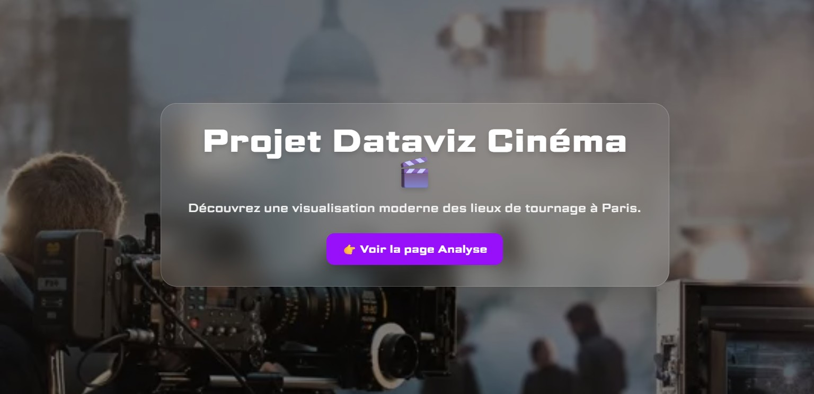
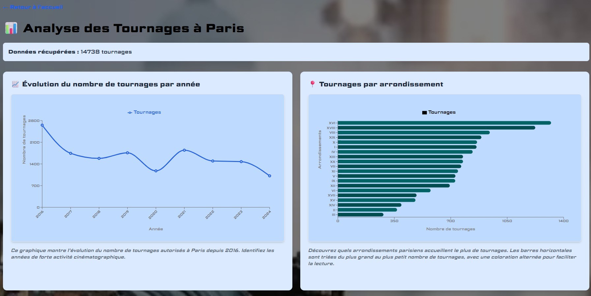
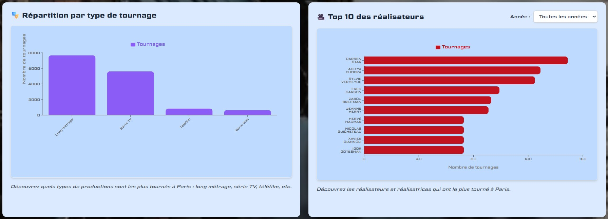
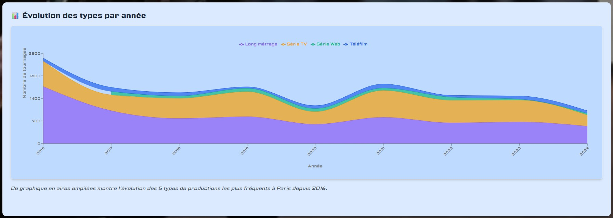

# 🎬 Dataviz Cinéma à Paris


> **Exploration interactive des lieux de tournage à Paris depuis 2016**

Une application web moderne qui visualise l'activité cinématographique parisienne à partir des données ouvertes de la Ville de Paris. Découvrez où, quand et comment Paris devient un plateau de cinéma.

## 📸 Aperçu

[Lien vers l'application déployée](#) *(à compléter après déploiement)*






## ✨ Fonctionnalités

### 📊 Visualisations interactives

- **Évolution temporelle** : Graphique en ligne montrant le nombre de tournages par année
- **Types de productions** : Répartition par catégorie (long métrage, série, téléfilm...)
- **Évolution des types** : Aires empilées montrant l'évolution des 5 types principaux
- **Tournages par arrondissement** : Barres horizontales classées par volume
- **Top réalisateurs** : Classement des réalisateurs les plus actifs avec filtre par année

### 🎯 Interactions utilisateur

- Filtrage dynamique par année sur le graphique des réalisateurs
- Infobulles détaillées sur chaque point de données
- Design responsive adapté mobile, tablette et desktop
- Interface moderne avec effets glassmorphism et animations

## 🛠️ Stack technique

### Frontend
- **React 18.3** - Bibliothèque UI
- **TypeScript 5.6** - Typage statique
- **Vite** - Build tool ultra-rapide
- **React Router 7** - Navigation SPA
- **Recharts** - Bibliothèque de graphiques

### Styling
- **Tailwind CSS** - Framework CSS utility-first
- **Google Fonts** (Science Gothic) - Typographie moderne

### Data
- **API OpenData Paris** - Source de données officielle
- Hook personnalisé `useParisData` pour la gestion des données
- Transformation et formatage centralisés

## 📦 Installation

### Prérequis

- Node.js >= 18.x
- npm ou yarn

### Étapes

```bash
# Cloner le dépôt
git clone https://github.com/David4976/projet-dataviz-davanto.git
cd projet-dataviz-davanto

# Installer les dépendances
npm install

# Lancer le serveur de développement
npm run dev

# Ouvrir http://localhost:5173
```

## 🚀 Scripts disponibles

```bash
npm run dev          # Lance le serveur de développement
npm run build        # Crée le build de production
npm run preview      # Prévisualise le build de production
npm run lint         # Vérifie le code avec ESLint
```

## 📁 Structure du projet

```
projet-dataviz-davanto/
│
├── public/
│   └── fond-ecran-accueil.webp    # Image de fond
│
├── src/
│   ├── api/
│   │   └── useParisData.ts        # Hook de récupération des données
│   │
│   ├── components/
│   │   ├── Footer.tsx
│   │   ├── TopRealisateursChart.tsx
│   │   ├── TournagesByArrChart.tsx
│   │   ├── TournagesByQuartChart.tsx
│   │   ├── TournagesByTypeChart.tsx
│   │   └── TypesByYearChart.tsx
│   │
│   ├── pages/
│   │   ├── Accueil.tsx            # Page d'accueil
│   │   └── Analyse.tsx            # Page d'analyse avec graphiques
│   │
│   ├── router/
│   │   └── router.tsx             # Configuration React Router
│   │
│   ├── styles/
│   │   └── index.css              # Styles globaux
│   │
│   ├── types/
│   │   ├── chartColors.ts         # Configuration des couleurs
│   │   └── types.d.ts             # Types TypeScript
│   │
│   ├── App.tsx                    # Composant racine
│   ├── Layout.tsx                 # Layout principal
│   └── main.tsx                   # Point d'entrée
│
├── index.html
├── package.json
├── tsconfig.json
├── vite.config.ts
└── README.md
```

## 🎨 Choix de conception

### Architecture des données

**Hook personnalisé centralisé** : `useParisData` gère toute la logique de récupération et transformation :
- Téléchargement progressif avec indicateur de chargement
- Filtrage des tournages hors Paris (codes postaux 75xxx)
- Formatage des arrondissements en chiffres romains (I, II, XX...)
- Normalisation des noms de réalisateurs en MAJUSCULES

### Design visuel

- **Palette cohérente** : Configuration centralisée dans `chartColors.ts`
- **Glassmorphism** : Effets de transparence et backdrop-blur
- **Responsive design** : Grid adaptative avec Tailwind breakpoints
- **Accessibilité** : Couleurs contrastées, labels explicites, alternance visuelle

### Performance

- Chargement unique des données au démarrage
- Calculs mémorisés avec `useMemo`
- Composants optimisés avec props typées
- Build optimisé avec Vite

## 📊 Source des données

**API utilisée** : [Lieux de tournage à Paris - OpenData](https://opendata.paris.fr/explore/dataset/lieux-de-tournage-a-paris/)

**Endpoint** : 
```
https://opendata.paris.fr/api/explore/v2.1/catalog/datasets/lieux-de-tournage-a-paris/exports/json
```

**Données disponibles** :
- Tournages autorisés depuis 2016
- 14 738 enregistrements
- Mise à jour régulière par la Ville de Paris

**Champs exploités** :
- `nom_tournage` - Titre du tournage
- `nom_realisateur` - Réalisateur·ice
- `type_tournage` - Long métrage, série, téléfilm...
- `annee_tournage` - Année
- `ardt_lieu` - Arrondissement (75001-75020)
- `geo_point_2d` - Coordonnées GPS

## 🎯 Objectifs pédagogiques atteints

✅ Consommation d'une API REST publique  
✅ Agrégation et transformation de données  
✅ Création de graphiques interactifs avec Recharts  
✅ Application React + TypeScript structurée  
✅ Routing avec React Router  
✅ Design responsive et accessible  
✅ Gestion d'état avec hooks React  
✅ Déploiement sur plateforme cloud  

## 🚧 Améliorations futures

- [ ] Carte interactive avec Leaflet ou Mapbox
- [ ] Export des données en CSV/PDF
- [ ] Comparaison inter-années
- [ ] Recherche par titre ou réalisateur
- [ ] Graphiques supplémentaires (sociétés de production, durées)
- [ ] Mode sombre
- [ ] Internationalisation (i18n)

## 👥 Équipe

**Développeurs** : David & Antoine M  
**Projet** : Dataviz CinéMA - École/Formation  
**Durée** : 3 semaines (novembre-décembre 2024)

## 📄 Licence

Ce projet est sous licence MIT. Voir le fichier [LICENSE](./LICENSE) pour plus de détails.

## 🙏 Remerciements

- **Ville de Paris** pour l'accès aux données ouvertes
- **Recharts** pour la bibliothèque de graphiques
- **React Team** pour l'écosystème React
- **Vercel** pour l'hébergement

## 📞 Contact

- 📧 Email : [votre-email@exemple.com]
- 🔗 GitHub Projet : [David4976/projet-dataviz-davanto](https://github.com/David4976/projet-dataviz-davanto)
- 🔗 GitHub Portfolio : [lien-vers-portfolio](#)

---

**⭐ N'hésitez pas à mettre une étoile si ce projet vous plaît !**

